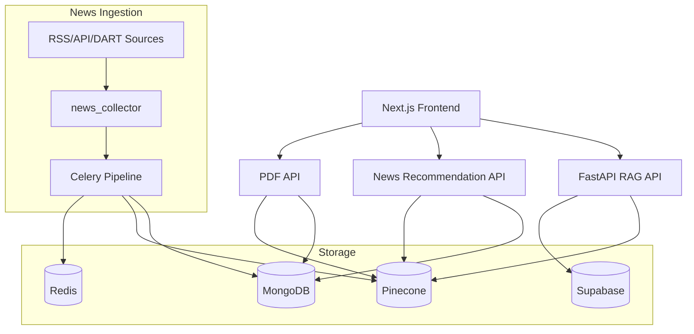
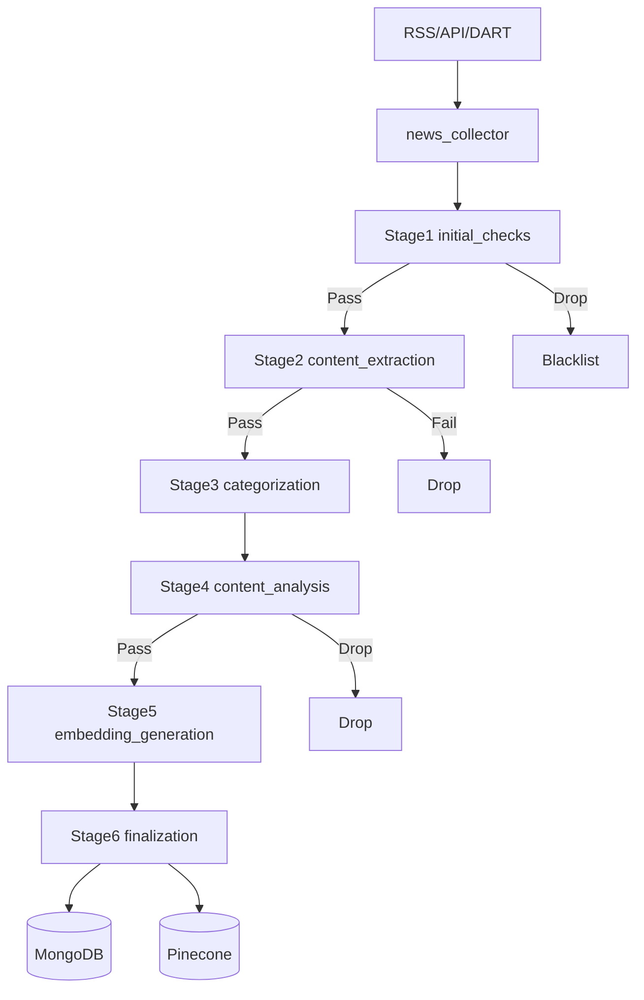
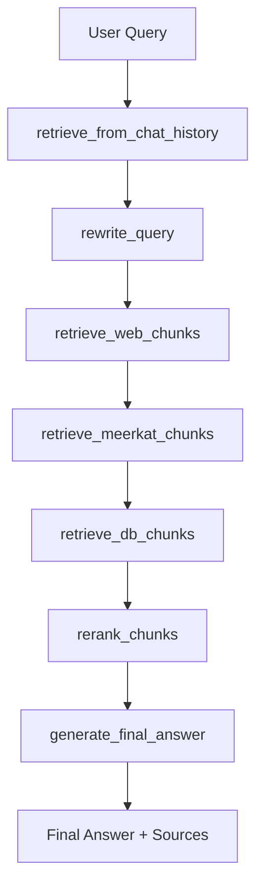

# AIGEN Science RAG Platform

뉴스/공시/PDF 데이터를 수집-정제-임베딩-검색-생성까지 연결한 End-to-End AI 플랫폼입니다.  
핵심 목표는 `3개 RAG 아키텍처(Vanilla, Modular, DOS)`를 동일한 벤치마크 환경에서 비교하고, 최종적으로 `Modular RAG`를 서비스 아키텍처로 채택하는 것입니다.


---

## 1) 프로젝트 핵심 요약

- 데이터 수집: RSS/API/DART에서 뉴스/공시를 자동 수집
- 데이터 처리: Celery 6단계 파이프라인으로 정제, 품질 필터링, 임베딩 생성, 중복 제거
- 검색/생성: Pinecone + LangGraph + OpenAI + Qwen3 기반 RAG 응답 생성
- 부가 서비스: PDF 인입/벡터화, 개인화 뉴스 추천, 알림 시스템
- 연구 결론: RAGAS 기준으로 `Modular RAG`가 가장 안정적/고성능이어서 최종 도입

---

## 2) RAG 연구 결과 (RAGAS 기반)

### 2.1 벤치마크 데이터셋

| 데이터셋 | 유형 | 용도 |
| --- | --- | --- |
| 자체제작 QA | 도메인 특화 QA | 실서비스 질문 패턴 검증 |
| QuALITY | 장문 독해 QA | 긴 문맥 이해 능력 평가 |
| HotpotQA | 멀티홉 QA | 추론/연결형 검색 평가 |
| NQ (Natural Questions) | 오픈도메인 QA | 일반 지식 질의응답 평가 |
| BioASQ | 바이오메디컬 QA | 전문 도메인 질의응답 평가 |

### 2.2 평가 기준

- 주요 지표: `Faithfulness`, `Answer Relevancy`, `Context Recall`, `Context Precision`
- 종합 점수(`Composite`) 계산식:

```text
Composite = (Faithfulness + Answer Relevancy + Context Recall + Context Precision) / 4
```

### 2.3 아키텍처 평균 성능 비교

| Architecture | Faithfulness | Answer Relevancy | Context Recall | Context Precision | Composite |
| --- | ---: | ---: | ---: | ---: | ---: |
| Vanilla RAG | 0.756 | 0.321 | 0.838 | 0.739 | 0.664 |
| DOS RAG | **0.859** | **0.714** | 0.876 | 0.480 | 0.732 |
| Modular RAG | 0.858 | 0.693 | **0.900** | **0.871** | **0.831** |

```text
RAGAS Composite (Architecture 평균)
Vanilla : ################################# 0.664
DOS     : ##################################### 0.732
Modular : ########################################## 0.831
```

### 2.4 5개 데이터셋 x 3개 아키텍처 비교 (Composite)

| Dataset | Vanilla | DOS | Modular | Winner |
| --- | ---: | ---: | ---: | --- |
| 자체제작 QA | 0.579 | 0.636* | **0.661*** | Modular |
| QuALITY | 0.639 | 0.730 | **0.817*** | Modular |
| HotpotQA | 0.653 | 0.745 | **0.867** | Modular |
| NQ | 0.733 | 0.726 | **0.911** | Modular |
| BioASQ | 0.715* | 0.825 | **0.897** | Modular |

```text
[자체제작 QA]
Vanilla : ############################# 0.579
DOS     : ################################ 0.636
Modular : ################################# 0.661

[QuALITY]
Vanilla : ################################ 0.639
DOS     : #################################### 0.730
Modular : ######################################### 0.817

[HotpotQA]
Vanilla : ################################# 0.653
DOS     : ##################################### 0.745
Modular : ############################################ 0.867

[NQ]
Vanilla : #################################### 0.733
DOS     : #################################### 0.726
Modular : ############################################## 0.911

[BioASQ]
Vanilla : ################################### 0.715
DOS     : ######################################### 0.825
Modular : ############################################# 0.897
```

### 2.5 데이터셋 자체 정답률 비교

| Dataset | Vanilla Accuracy | DOS Accuracy | Modular Accuracy | Winner |
| --- | ---: | ---: | ---: | --- |
| 자체제작 QA | 25.00% | 27.00% | **31.00%*** | Modular |
| QuALITY | 80.15% | 81.02% | **82.70%*** | Modular |
| HotpotQA | 42.00% | 57.00% | **60.50%*** | Modular |
| NQ | 16.67% | 16.00% | **21.50%*** | Modular |
| BioASQ | 6.00%* | 3.50% | **9.50%*** | Modular |

### 2.6 Modular RAG 모듈 선택 실험 (첨부 MD 반영)

| Dataset | Query Expansion | Retriever | Reranker | Compressor | 최종 판단 |
| --- | --- | --- | --- | --- | --- |
| HotpotQA | `naive_rag` | `hybrid_retriever` | `no_reranker` | `FALSE` | 안정성 기준으로 압축 OFF |
| BioASQ | `hyde_rag` 우세 | `hybrid_retriever` | `no_reranker` | `FALSE` | 전문 도메인에서 HyDE 유효 |
| NQ | `naive_rag` | `dense_retriever` | `no_reranker` | `FALSE` | 일반 도메인 dense 우세 |
| QuALITY | `naive_rag` | `dense_retriever` | `no_reranker` | `FALSE`* | 장문 질의에서 dense 안정 |
| 자체제작 QA | `naive_rag`* | `hybrid_retriever`* | `no_reranker`* | `FALSE`* | 실서비스 쿼리형 기준 |

### 2.7 연구 결론

- RAGAS 종합 점수 기준 `Modular RAG`가 5개 데이터셋 전체에서 최상위
- 특히 `Context Precision`과 `Context Recall` 동시 확보 측면에서 Modular이 일관적으로 우세
- 따라서 최종 운영 아키텍처를 `Modular RAG`로 결정

---

## 3) RAG 아키텍처 정의

| Architecture | 개념 | 강점 | 한계 |
| --- | --- | --- | --- |
| Vanilla RAG | 단일 검색기 + 단순 생성 | 단순, 구현 난이도 낮음 | 데이터셋별 성능 편차 큼 |
| Modular RAG | 질의 확장/검색/재정렬/압축 모듈 조합 | 성능 튜닝 유연성, 최고 성능 | 모듈 선택/튜닝 비용 필요 |
| DOS RAG | 분해/확장 중심 고비용 검색 전략 | 고난도 질문 대응 강점 | 비용/토큰 사용량 증가 가능 |

---

## 4) 현재 코드에 반영된 Modular RAG 구현

| 파이프라인 단계 | 구현 모듈 | 코드 위치 |
| --- | --- | --- |
| Query Rewrite | LLM 기반 쿼리 재작성 | `src/rag_graph/graph_rag.py` |
| Web Retrieval | Naver Web/News 다중 검색 | `src/services/web_search.py` |
| Domain Expert Retrieval | Meerkat-7B 생성형 보조 문맥 | `src/rag_graph/graph_rag.py` |
| DB Retrieval | Dense Retrieval (Pinecone) | `src/services/advanced_retrieval.py` |
| Re-ranking | Qwen3 기반 재정렬 | `src/services/advanced_retrieval.py`, `src/rag_graph/graph_rag.py` |
| Final Generation | GPT 기반 최종 답변 + 출처 병합 | `src/rag_graph/graph_rag.py` |

---

## 5) 전체 시스템 아키텍처



---

## 6) 주요 기능

- 뉴스/공시 자동 수집: API, RSS, DART를 통합 수집 후 Celery 큐로 전달
- 6단계 데이터 파이프라인: 초기검사 -> 본문추출 -> 키워드추출 -> 품질분석 -> 임베딩 -> 최종저장
- 하이브리드 RAG 질의응답: DB 검색 + 웹 검색 + 도메인 모델(Meerkat) 통합
- 고급 검색: Dense Retrieval + Qwen3 Reranker
- PDF 인입 파이프라인: PDF 텍스트 추출, GPT 분석, chunk 임베딩, MongoDB/Pinecone 저장
- 개인화 추천 API: 사용자 관심사 임베딩 기반 기사 추천
- 실시간 스트리밍 응답: `/rag-chat-stream` 이벤트 스트림 지원

---

## 7) 워크플로우 다이어그램

### 7.1 뉴스 수집 및 처리 파이프라인



### 7.2 RAG 쿼리 처리 워크플로우



---

## 8) 기술 스택

| 영역 | 스택 |
| --- | --- |
| Backend | Python, FastAPI, Celery, Redis |
| Data | MongoDB, Pinecone, Supabase |
| LLM/RAG | OpenAI GPT, OpenAI Embeddings, LangChain, LangGraph, Transformers, Qwen3-Reranker |
| Crawling/ETL | requests, feedparser, newspaper3k, BeautifulSoup |
| PDF | PyPDF2, LangChain Text Splitter |
| Frontend | Next.js 14, TypeScript, Tailwind CSS, Supabase Client |
| Infra | Docker, Docker Compose, GPU(CUDA) |

---

## 9) 폴더 구조 (간단)

```text
Aigen_science_RAG/
├─ src/
│  ├─ app/                  # FastAPI 서비스들 (rag_api, news, pdf)
│  ├─ rag_graph/            # LangGraph RAG 워크플로우
│  ├─ services/             # advanced_retrieval, web_search, pdf_processor
│  ├─ news_collector/       # RSS/API/DART 수집
│  ├─ pipeline_stages/      # Celery 6단계 처리
│  ├─ db/                   # Pinecone 래퍼
│  └─ config_loader/        # config/env 로더
├─ frontend/                # Next.js UI
├─ docker/                  # Dockerfiles, compose, requirements
├─ tests/                   # 통합/모듈 테스트
├─ docs/                    # 운영/최적화 문서
├─ config/                  # config.yaml.template
└─ database/                # SQL 스키마
```

---

## 10) 실행 방법

### 10.1 설정 파일 준비

```bash
cp config/config.yaml.template config/config.yaml
cp env.template .env
```

Windows PowerShell:

```powershell
Copy-Item config/config.yaml.template config/config.yaml
Copy-Item env.template .env
```

다음 키는 필수로 채워야 합니다.

- `OPENAI_API_KEY`
- `PINECONE_API_KEY`
- `MONGO_URI`
- `DART_API_KEY`, `NAVER_CLIENT_ID`, `NAVER_CLIENT_SECRET` (수집용)

### 10.2 Docker 실행

```bash
docker compose -f docker/docker-compose.yml up -d --build
```

기본 포트:

- Frontend: `3000`
- RAG API: `8010`
- Recommendation API: `8001`
- News Article API: `8002`
- PDF API: `8013`
- Redis: `6379`
- MongoDB: `27017`

### 10.3 헬스체크

```bash
curl http://localhost:8010/health
curl http://localhost:8001/health
curl http://localhost:8002/health
```

---

## 11) 주요 API

| Service | Method | Endpoint | 설명 |
| --- | --- | --- | --- |
| RAG API | `POST` | `/rag-chat` | 동기 RAG 응답 |
| RAG API | `POST` | `/rag-chat-stream` | 스트리밍 RAG 응답 |
| RAG API | `GET` | `/health` | 상태 확인 |
| Recommendation API | `POST` | `/recommendations` | 개인화 뉴스 추천 |
| News Article API | `GET` | `/articles/{article_id}` | 기사 상세 조회 |
| PDF API | `POST` | `/upload-pdf` | PDF 업로드/처리 |
| PDF API | `GET` | `/search-pdfs` | PDF 벡터 검색 |

---

## 12) 참고 사항

- `frontend/README.md`는 원본 Chatbot UI 문서가 남아 있으며, 본 프로젝트 설명은 이 루트 `README.md`를 기준으로 유지합니다.
- RAG 연구 수치는 첨부 실험 노트(`제목 없음 318498e9d37f8074a349e2de0ccdf565.md`)를 반영했습니다.
