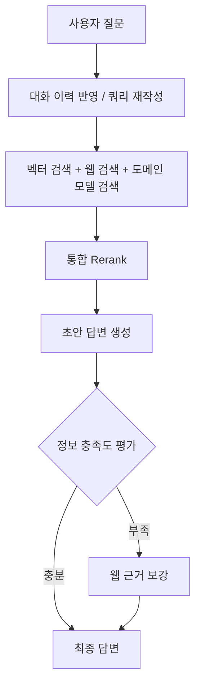
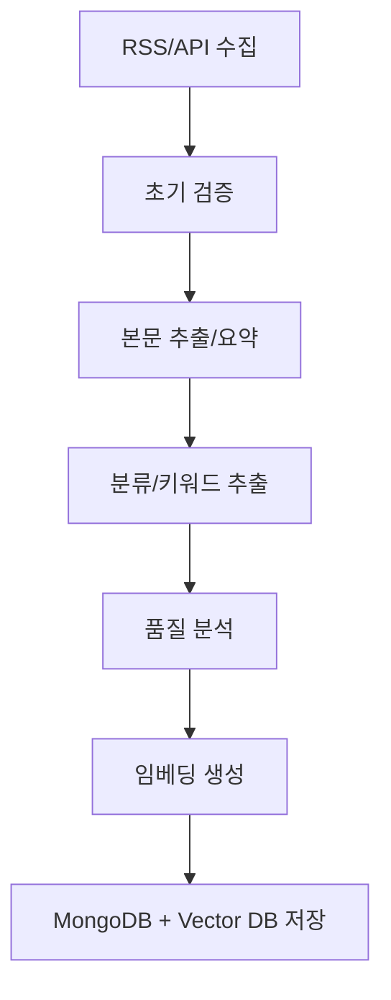

# AIGEN Science RAG

AIGEN Science RAG는 **과학/의료 도메인 질의응답 품질을 높이기 위해 설계한 연구 중심 RAG 프로젝트**입니다. 단순히 "문서를 검색해서 붙여 넣는" 방식이 아니라, 실제 질문 상황에서 필요한 정보를 얼마나 정확하고 신뢰성 있게 제공하는지를 핵심 목표로 두고 설계했습니다. 특히 본 프로젝트는 **Naive RAG → Modular RAG → DOS RAG**로 구조를 확장하면서, 데이터셋별(HotpotQA, BioASQ, NQ, QuALITY) 성능 변화를 정량적으로 비교하고, 각 모듈(Pre-Retriever, Retriever, Reranker, Compressor)의 효과를 실험적으로 검증합니다.

또한 서비스 관점에서는 뉴스 수집/정제 파이프라인과 LangGraph 기반 질의 처리 워크플로우를 연결해, 최신 정보 수집부터 답변 생성까지 일관된 흐름을 제공합니다. 즉, 이 저장소는 단순 데모가 아니라 **"워크플로우 설계 + 모델링 전략 + 벤치마크 결과"를 함께 담은 실험/개발 레포지토리**입니다.

---

## 아키텍처


---

## RAG 연구 결과 (핵심)

> 아래 내용은 `제목 없음 318498e9d37f8074a349e2de0ccdf565.md`의 실험 로그를 바탕으로, 의사결정에 중요한 결과만 요약한 것입니다.

### 1) Modular RAG 실험에서의 선택 요약

- **HOTPOT QA**
  - Query expansion: 차이 미미 → **naive 선택**
  - Retrieval: sparse 제외 유사, 운영상 **hybrid 선택**
  - Reranker: **no reranker가 근소 우세**
  - Compressor: **비활성(FALSE) 설정 유지**

- **BioASQ**
  - Query expansion: **HyDE 우세**
  - Retrieval/Reranker/Compressor 조합 실험 후 데이터셋별 최적 조합 반영

- **NQ**
  - 최종 지표 기준으로 높은 정답 관련성/충실도 유지

- **QuALITY**
  - Query expansion: 차이 미미 → **naive 선택**
  - Retrieval: naive 제외 시 **dense 우세**

### 2) DOS RAG 최종 성능 요약 (데이터셋별 평균)

| Dataset | Context Precision | Context Recall | Faithfulness | Answer Relevancy |
|---|---:|---:|---:|---:|
| BioASQ | 0.503 | 0.929 | 0.945 | 0.921 |
| NQ | 0.420 | 0.919 | 0.853 | 0.713 |
| QuALITY | 0.299 | 1.000 | 0.929 | 0.692 |
| HOTPOT | 0.479 | 0.750 | 0.958 | 0.792 |

해석 포인트:
- DOS RAG는 전반적으로 **Faithfulness(충실도)**가 높고,
- 데이터셋 성격에 따라 **Answer Relevancy(답변 관련성)** 편차가 존재하며,
- 따라서 단일 고정 전략보다 **모듈 조합 최적화**가 효과적임을 확인했습니다.

---

## 워크플로우 다이어그램

### 1) LangGraph 기반 RAG 워크플로우



### 2) 뉴스 처리 파이프라인



---

## 주요 기능 (요약)

- 자동 뉴스 수집 및 품질 기반 전처리
- LangGraph 기반 멀티-스텝 RAG 질의 처리
- Dense/Hybrid 검색 및 재정렬 기반 컨텍스트 최적화
- 데이터셋 기반 정량 평가(RAGAS 등)

## 기술 스택 (요약)

- **Backend**: Python, FastAPI, Celery, Redis, MongoDB
- **RAG/LLM**: LangChain, LangGraph, OpenAI API, Pinecone
- **Frontend**: Next.js, TypeScript, Tailwind CSS
- **Infra**: Docker, Docker Compose

---

## 최소 폴더 구조

```text
.
├── README.md
├── src/                # 핵심 백엔드 및 RAG 로직
├── frontend/           # Next.js 프론트엔드
├── tests/              # 테스트 코드
├── docs/               # 부가 문서
└── 제목 없음 318498e9d37f8074a349e2de0ccdf565.md  # RAG 연구 원본 결과
```
