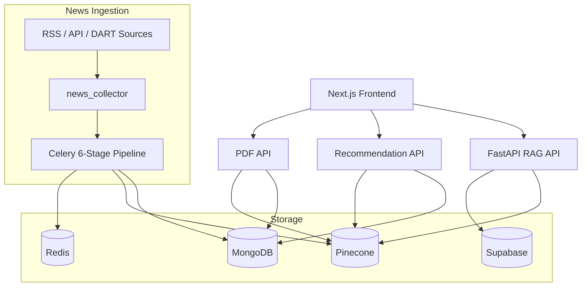
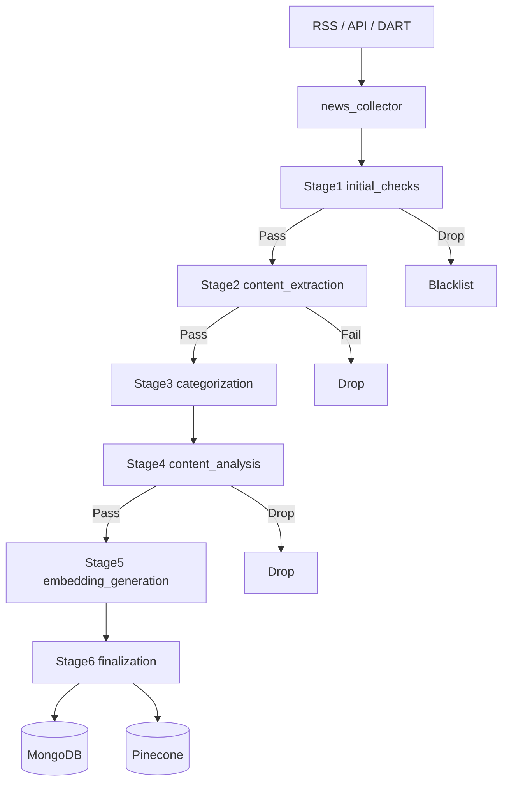
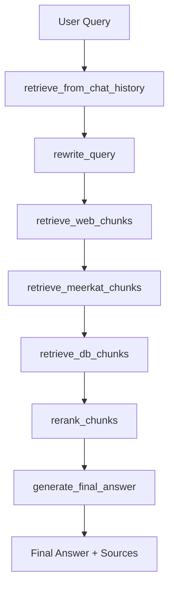

# AIGEN Science RAG Platform

뉴스, 공시, PDF 데이터를 수집하고 정제한 뒤, 임베딩과 검색을 거쳐 최종 답변과 추천까지 연결하는 End-to-End AI 플랫폼입니다.

이 문서는 단순한 개발자용 사용 설명서가 아니라, "이 프로젝트가 왜 필요했고, 무엇을 만들었고, 어떤 기술적 선택을 했는가"를 AI에 관심이 많은 비전공자도 이해할 수 있도록 풀어서 설명하는 발표형 README입니다.


---

## 1. 먼저, 왜 RAG가 필요한가

요즘 AI를 이야기할 때 가장 먼저 떠오르는 것은 ChatGPT 같은 LLM입니다.  
LLM은 자연스럽게 말을 만들고, 질문을 요약하고, 문장을 정리하고, 사람처럼 대화를 이어가는 데 매우 뛰어납니다.  
하지만 여기서 꼭 짚어야 할 점이 있습니다.  
LLM은 "말을 잘하는 모델"이지, "항상 최신의 정확한 사실을 보장하는 데이터베이스"는 아닙니다.

실제 서비스에서는 바로 이 지점 때문에 LLM만 단독으로 붙이면 한계가 금방 드러납니다.

### 1.1 LLM의 한계: 환각, 최신성 부족, 근거 부족

첫 번째 문제는 **환각(Hallucination)** 입니다.  
환각은 AI가 모르는 내용을 "모른다"고 말하지 않고, 그럴듯한 답을 만들어내는 현상입니다.  
겉으로 보면 매우 자연스럽고 자신감 있게 말하기 때문에, 오히려 더 위험합니다.  
특히 의료, 과학, 공시, 뉴스처럼 사실 관계가 중요한 영역에서는 이 문제가 치명적일 수 있습니다.

두 번째 문제는 **최신성 부족**입니다.  
LLM은 학습 시점까지의 패턴을 바탕으로 답을 만들기 때문에, 방금 나온 뉴스나 새로 올라온 공시, 최근 업로드된 PDF 문서를 자동으로 알고 있지 않습니다.  
즉 세상이 바뀌어도 모델이 그 변화를 즉시 따라가는 것은 아닙니다.  
최신 문서를 반영하려면 외부 지식을 그때그때 연결해줘야 합니다.

세 번째 문제는 **근거성 부족**입니다.  
일반적인 LLM 답변은 "왜 이런 답을 했는지" 근거 문서를 명확히 제시하지 못하는 경우가 많습니다.  
사용자 입장에서는 답변이 맞는지 틀린지 판단하기 어렵고, 운영자 입장에서는 신뢰성과 책임성을 확보하기 어렵습니다.  
실제 업무에서는 "좋은 문장"보다 "어떤 자료를 바탕으로 이런 답을 했는가"가 더 중요합니다.

정리하면, LLM은 언어 생성 능력은 매우 강하지만 아래 세 가지가 약합니다.

- 최신 정보 반영
- 외부 문서 근거 제시
- 사실 기반 답변 안정성

이 세 가지 약점을 보완하기 위해 나온 대표적인 방식이 바로 **RAG(Retrieval-Augmented Generation)** 입니다.

### 1.2 RAG란 무엇인가

RAG는 아주 단순하게 말하면, **질문에 답하기 전에 먼저 관련 문서를 찾고, 그 문서를 근거로 답하도록 만드는 구조**입니다.

사람으로 비유하면 이렇습니다.

- LLM만 사용하는 방식은 "기억에 의존해서 바로 대답하는 사람"에 가깝습니다.
- RAG는 "먼저 자료를 찾고, 그 자료를 읽은 뒤, 근거를 바탕으로 설명하는 사람"에 가깝습니다.

즉 RAG의 핵심은 모델을 더 똑똑하게 "만드는 것"보다, 모델이 답하기 전에 **필요한 지식을 연결해 주는 것**입니다.

그래서 RAG는 다음 같은 상황에서 특히 중요합니다.

- 최신 뉴스나 공시를 다뤄야 할 때
- 사내 문서나 PDF를 기반으로 답해야 할 때
- 출처와 근거를 보여줘야 할 때
- 특정 산업 도메인 문서를 자주 검색해야 할 때

---

## 2. RAG가 해결하는 두 번째 문제: 기억상실증과 멀티턴 문맥

RAG를 이해할 때 많은 분들이 "외부 문서를 붙이는 기술" 정도로만 생각합니다.  
하지만 실제 서비스에서는 그것만으로 충분하지 않습니다.  
사용자는 한 번만 질문하지 않고, 앞의 대화를 이어서 여러 번 질문합니다.  
바로 여기서 **멀티턴 문맥(Multi-turn Context)** 문제가 등장합니다.

### 2.1 왜 LLM은 대화에서 자주 맥락을 놓치는가

사람은 방금 전에 무슨 이야기를 했는지 비교적 자연스럽게 기억합니다.  
하지만 LLM은 사람처럼 영속적인 기억을 갖고 있는 존재가 아닙니다.  
대화를 이어가는 것처럼 보여도, 실제로는 입력된 문맥 안에서만 계산하고 있을 뿐입니다.  
그래서 이전 질문, 이전 답변, 사용자의 관심사, 방금 언급한 대상이 길어질수록 쉽게 흐려질 수 있습니다.

예를 들어 사용자가 이렇게 질문한다고 가정해보겠습니다.

1. "최근 바이오 헬스케어 투자 동향 정리해줘"
2. "그중에서 규제 이슈가 큰 항목만 다시 설명해줘"
3. "이번엔 PDF에 있는 내용 기준으로만 말해줘"

이때 세 번째 질문은 단독으로 보면 매우 불완전합니다.  
"이번엔", "그중에서", "PDF에 있는 내용 기준으로만" 같은 표현은 앞선 대화 맥락을 알아야 이해할 수 있습니다.  
이전 문맥을 놓치면 AI는 엉뚱한 주제를 다시 설명하거나, 사용자가 원하지 않은 방식으로 답할 수 있습니다.

### 2.2 그래서 왜 세션 이력과 외부 지식 연결이 함께 필요할까

실제 서비스형 RAG에서는 두 가지를 동시에 다뤄야 합니다.

첫째, **세션 기반 대화 이력 관리**입니다.  
사용자가 직전에 무엇을 물었는지, 어떤 표현을 이어받고 있는지, 관심 주제가 무엇인지 추적해야 합니다.

둘째, **외부 지식 검색**입니다.  
대화 맥락을 이해했다고 해도, 답변의 근거가 될 최신 기사나 공시나 PDF를 실제로 가져오지 않으면 결국 환각 가능성은 남아 있습니다.

즉 멀티턴 서비스에서 중요한 것은 아래 둘의 결합입니다.

- "사용자가 지금 무슨 맥락에서 질문하는가"
- "그 질문에 대해 지금 어떤 외부 자료를 찾아야 하는가"

AIGEN은 바로 이 지점을 중요하게 봤습니다.  
단순히 검색 한 번 하고 답하는 구조가 아니라, **대화 문맥을 읽고, 질문을 다시 정리하고, 여러 검색 경로를 결합한 뒤, 최종 답변을 만드는 구조**를 채택했습니다.

---

## 3. RAG를 구성하는 핵심 기술을 쉽게 설명하면

RAG를 구성하는 기술 이름은 낯설어 보이지만, 각각의 역할은 비교적 분명합니다.  
이 프로젝트를 이해하려면 아래 개념을 순서대로 보면 됩니다.

### 3.1 Embedding

**Embedding**은 문서나 문장을 숫자 벡터로 바꾸는 과정입니다.  
컴퓨터는 문장의 의미를 사람처럼 바로 이해하지 못하므로, 의미를 비교할 수 있는 좌표 같은 형태로 변환해야 합니다.  
이렇게 변환해두면 "표현은 달라도 의미가 비슷한 문장"을 가까운 위치로 찾을 수 있습니다.  
AIGEN에서는 뉴스, 공시, PDF 조각들을 임베딩해서 검색 가능한 형태로 저장하는 것이 핵심 전처리 단계입니다.

쉽게 말하면, 임베딩은 문서를 "검색 가능한 의미 지도" 위에 올려놓는 작업입니다.

### 3.2 Vector Search

**Vector Search**는 임베딩된 문서들 중에서 질문과 의미적으로 가까운 문서를 찾는 검색 방식입니다.  
단어가 정확히 일치하지 않아도 비슷한 뜻의 문서를 찾을 수 있다는 점이 강점입니다.  
예를 들어 사용자가 "바이오 규제 리스크"라고 물었을 때 문서에 "허가 지연 가능성"이라고 써 있어도 의미적으로 연결될 수 있습니다.  
AIGEN에서는 이런 의미 기반 검색이 최신 과학·의료 문서를 다룰 때 매우 중요합니다.

쉽게 비유하면 키워드 검색이 "단어 찾기"라면, Vector Search는 "뜻 찾기"에 가깝습니다.

### 3.3 Hybrid Search

**Hybrid Search**는 Vector Search와 키워드 검색을 함께 쓰는 방식입니다.  
의미 검색은 유연하지만, 고유명사나 숫자나 종목명처럼 정확한 문자열이 중요한 상황에서는 키워드 검색이 더 강할 수 있습니다.  
반대로 키워드 검색은 정확한 단어가 다르면 놓치기 쉽지만, 의미 검색은 그 약점을 보완할 수 있습니다.  
그래서 두 방식을 섞으면 semantic과 lexical의 장점을 함께 가져갈 수 있습니다.

AIGEN이 다루는 뉴스, 공시, PDF는 의미 유사성과 정확한 키워드 매칭이 모두 중요하기 때문에 Hybrid Search가 자연스러운 선택이 됩니다.

### 3.4 Reranker

검색은 보통 여러 개의 후보 문서를 가져옵니다.  
하지만 처음 검색된 순서가 항상 최종적으로 가장 좋은 순서인 것은 아닙니다.  
**Reranker**는 1차 검색 결과를 다시 읽고, 질문과의 관련성을 더 정밀하게 따져서 순서를 재정렬하는 모듈입니다.  
즉 "후보를 찾는 단계"와 "후보를 다시 줄 세우는 단계"를 분리해 정밀도를 높이는 것입니다.

AIGEN에서는 Qwen3 기반 재정렬기를 사용해, 웹 검색 결과와 DB 검색 결과를 한 번 더 정리해 최종 문맥 품질을 높이도록 설계했습니다.

### 3.5 Evidence

**Evidence**는 "이 답변이 어떤 문서를 근거로 만들어졌는가"를 추적하는 개념입니다.  
이 기능이 있으면 사용자는 답변을 그냥 믿는 것이 아니라, 함께 제시된 출처를 보고 검증할 수 있습니다.  
운영 관점에서도 Evidence는 매우 중요합니다.  
왜냐하면 AI 서비스를 실제로 쓰려면 정답률뿐 아니라 설명 가능성과 신뢰성을 함께 관리해야 하기 때문입니다.

쉽게 말하면, Evidence는 AI 답변에 붙는 "근거 자료 표시"입니다.

### 3.6 Fine-tuning과 RAG의 차이

이 둘은 자주 함께 언급되지만, 해결하는 문제가 다릅니다.

**Fine-tuning**은 모델 자체를 다시 학습시켜 말투, 형식, 특정 작업 성향을 바꾸는 방식입니다.  
즉 모델의 내부 성향을 조정하는 데 강합니다.  
반면 **RAG**는 모델을 새로 학습시키기보다, 답변 시점에 필요한 외부 문서를 실시간으로 붙이는 방식입니다.  
즉 최신성, 출처, 문서 기반 응답이라는 문제에 더 직접적으로 대응합니다.

| 항목 | RAG | Fine-tuning |
| --- | --- | --- |
| 핵심 목적 | 필요한 지식을 실시간으로 붙인다 | 모델 자체의 성향과 출력을 조정한다 |
| 강한 영역 | 최신 문서 반영, 출처 제시, 문서 기반 QA | 말투 고정, 형식 최적화, 특정 작업 패턴 학습 |
| 데이터 변화 대응 | 새 문서 추가로 비교적 빠르게 반영 가능 | 데이터가 바뀔 때 다시 학습 비용이 큼 |
| 이 프로젝트에서의 적합성 | 매우 높음 | 보조 수단으로는 가능하지만 우선순위는 낮음 |

AIGEN에서는 최신 뉴스, 공시, PDF를 반영해야 하고, 근거 제시와 운영 유연성이 중요하기 때문에 Fine-tuning보다 RAG가 더 적합했습니다.  
다만 장기적으로는 말투 일관성이나 특정 리포트 형식 최적화가 중요해질 경우 Fine-tuning을 보조 축으로 검토할 수 있습니다.

---

## 4. 이 프로젝트는 무엇을 해결하려고 했는가

이 프로젝트의 출발점은 단순합니다.  
**의료·과학 영역에서는 최신 문서와 근거 기반 응답이 매우 중요하지만, 일반적인 LLM만으로는 이를 안정적으로 처리하기 어렵다**는 문제의식입니다.

특히 다음과 같은 요구가 동시에 존재했습니다.

- 최신 뉴스와 공시를 빠르게 반영해야 한다
- PDF 문서까지 함께 탐색하고 답변에 활용해야 한다
- 사용자 질문에 대한 답변뿐 아니라 추천 기능도 필요하다
- 단순 데모가 아니라 실제 서비스처럼 동작해야 한다

그래서 AIGEN은 "질문 한 번 잘 답하는 챗봇"이 아니라, 아래를 모두 포함하는 구조로 설계되었습니다.

- 외부 데이터 수집
- 데이터 정제 및 품질 관리
- 임베딩 및 벡터 저장
- 검색 및 재정렬
- 최종 답변 생성
- 개인화 추천
- PDF 업로드와 처리
- 스트리밍 응답 API

즉 AIGEN은 챗봇이 아니라, **지식을 운영 가능한 형태로 다루는 플랫폼**입니다.

### 4.1 프로젝트 한 줄 요약

> 뉴스, 공시, PDF 데이터를 수집-정제-임베딩-검색-생성까지 연결한 End-to-End AI 플랫폼

### 4.2 왜 단순 챗봇이 아니라 플랫폼인가

챗봇은 보통 사용자의 질문에 답하는 화면만 떠올리기 쉽습니다.  
하지만 실제 현업 서비스는 그 이전 단계가 훨씬 더 중요합니다.  
좋은 답변은 좋은 데이터에서 나오고, 좋은 데이터는 수집과 정제와 저장 체계가 있어야 유지됩니다.  
AIGEN은 바로 이 "보이지 않는 백엔드 흐름"까지 포함해 설계된 시스템입니다.

---

## 5. AIGEN 전체 구조를 데이터 흐름으로 보면

이 프로젝트는 기술 이름보다 **데이터가 어떻게 흘러가는지**로 보면 이해가 더 쉽습니다.


```mermaid
flowchart TB
    FE[Next.js Frontend] --> RAGAPI[FastAPI RAG API]
    FE --> RECAPI[Recommendation API]
    FE --> PDFAPI[PDF API]

    subgraph Ingestion[News Ingestion]
        SRC[RSS / API / DART Sources] --> COL[news_collector]
        COL --> CELERY[Celery 6-Stage Pipeline]
    end

    subgraph Storage[Storage]
        MONGO[(MongoDB)]
        PINE[(Pinecone)]
        REDIS[(Redis)]
        SUPA[(Supabase)]
    end

    CELERY --> MONGO
    CELERY --> PINE
    CELERY --> REDIS
    RECAPI --> MONGO
    RECAPI --> PINE
    PDFAPI --> MONGO
    PDFAPI --> PINE
    RAGAPI --> PINE
    RAGAPI --> SUPA
```

이 구조를 쉽게 풀면 다음과 같습니다.

### 5.1 데이터 입력

- RSS, 외부 API, DART 공시 등에서 문서를 자동 수집합니다.
- 사용자가 별도로 PDF를 업로드할 수도 있습니다.

즉 데이터는 밖에서 계속 들어오며, 플랫폼은 이 흐름을 받아 처리해야 합니다.

### 5.2 처리 파이프라인

수집한 데이터를 바로 검색에 쓰지 않고, Celery 기반 비동기 파이프라인으로 정제합니다.  
이 단계가 중요한 이유는, 품질이 낮은 문서가 그대로 들어가면 검색과 답변 품질도 흔들리기 때문입니다.  
운영형 RAG에서 검색 품질은 검색기만의 문제가 아니라, 입력 데이터 품질의 문제이기도 합니다.  
그래서 AIGEN은 "먼저 데이터를 제대로 준비하는 것"을 시스템의 핵심으로 봤습니다.

### 5.3 저장 레이어

- MongoDB: 원문과 메타데이터 저장
- Pinecone: 임베딩 기반 벡터 검색 저장소
- Redis: 파이프라인과 캐시성 작업 보조
- Supabase: 서비스 레이어와 연결되는 일부 저장/사용자 기능 보조

저장소를 여러 개 쓴 이유는, 모든 문제를 한 저장소로 해결하기보다 **역할별로 가장 적합한 저장 방식을 분리했기 때문**입니다.

### 5.4 서비스 레이어

그 위에 FastAPI 기반 서비스들이 올라갑니다.

- RAG API: 문서 기반 질의응답
- Recommendation API: 개인화 뉴스 추천
- PDF API: PDF 업로드, 분석, 검색
- Frontend: 사용자가 실제로 접하는 화면

즉 AIGEN은 하나의 모델 API가 아니라, **여러 기능이 연결된 서비스 구조**입니다.

---

## 6. 뉴스와 문서가 준비되는 6단계 데이터 파이프라인

운영형 RAG에서는 질문 처리만 잘한다고 끝나지 않습니다.  
검색할 문서가 엉성하면, 아무리 좋은 모델과 좋은 프롬프트를 붙여도 결과가 흔들립니다.  
그래서 AIGEN은 수집 이후 단계에 많은 비중을 둡니다.


```mermaid
flowchart TD
    A[RSS / API / DART] --> B[news_collector]
    B --> C[Stage1 initial_checks]
    C -->|Pass| D[Stage2 content_extraction]
    C -->|Drop| Z1[Blacklist]
    D -->|Pass| E[Stage3 categorization]
    D -->|Fail| Z2[Drop]
    E --> F[Stage4 content_analysis]
    F -->|Pass| G[Stage5 embedding_generation]
    F -->|Drop| Z3[Drop]
    G --> H[Stage6 finalization]
    H --> M[(MongoDB)]
    H --> P[(Pinecone)]
```

각 단계의 의미를 쉽게 설명하면 이렇습니다.

### 6.1 초기 검사

수집한 문서가 기본적으로 처리할 가치가 있는지 확인하는 단계입니다.  
형식이 깨졌거나, 중복이 심하거나, 신뢰하기 어려운 입력은 이 단계에서 걸러낼 수 있습니다.  
이 과정을 통해 뒤 단계가 불필요한 비용을 쓰지 않게 됩니다.  
쉽게 말하면 "들어온 데이터를 무조건 다 쓰지 않고 1차 검수하는 단계"입니다.

### 6.2 본문 추출

실제 검색에 쓸 수 있는 텍스트를 추출하는 단계입니다.  
웹 문서나 기사에는 광고, 메뉴, 불필요한 레이아웃 정보가 섞여 있을 수 있기 때문에 본문을 정리해야 합니다.  
이 작업이 부정확하면 임베딩도 흐려지고 검색 품질도 떨어집니다.  
즉 답변 품질의 출발점은 본문 추출 정확도입니다.

### 6.3 분류 및 카테고리화

문서를 어떤 주제와 유형으로 볼 것인지 정리하는 단계입니다.  
뉴스, 공시, 보고서, 의료 정보 등은 검색 전략이 다를 수 있기 때문에 분류가 중요합니다.  
이 단계가 있으면 이후 추천이나 필터링에서도 활용도가 높아집니다.  
운영 관점에서는 문서가 "쌓이는 것"보다 "구조적으로 정리되는 것"이 더 중요합니다.

### 6.4 품질 분석

문서가 실제 검색과 답변의 근거로 쓰일 만한 품질인지 판단하는 단계입니다.  
너무 짧거나, 정보량이 낮거나, 신뢰성이 떨어지는 문서는 최종 검색 대상에서 제외하는 것이 오히려 더 좋은 결과를 줍니다.  
이 과정은 검색기의 정밀도를 높이는 간접적이지만 매우 중요한 장치입니다.  
즉 이 단계는 "문서를 벡터로 바꾸기 전에 품질을 한 번 더 보는 장치"입니다.

### 6.5 임베딩 생성

정제된 문서를 의미 기반 검색이 가능한 벡터로 바꾸는 단계입니다.  
이제 문서는 단순 텍스트가 아니라 검색 가능한 표현으로 변환됩니다.  
이 과정을 통해 사용자의 질문과 의미적으로 가까운 문서를 찾을 수 있게 됩니다.  
RAG에서 임베딩은 검색 엔진의 기반 좌표계를 만드는 작업이라고 볼 수 있습니다.

### 6.6 최종 저장

처리된 문서는 목적에 맞는 저장소에 들어갑니다.  
원문과 메타데이터는 관리 저장소에, 벡터는 Pinecone 같은 검색 저장소에 보관됩니다.  
이렇게 분리해두면 검색 성능과 운영 편의성을 함께 챙길 수 있습니다.  
즉 문서는 "보관용"과 "검색용" 관점이 분리되어 관리됩니다.

---

## 7. 질문이 들어왔을 때 내부에서는 무슨 일이 일어나는가

사용자가 질문을 던지면 AI가 곧바로 답하는 것처럼 보이지만, 실제 내부에서는 여러 단계가 차례로 실행됩니다.  
이 흐름이 AIGEN의 핵심 가치 중 하나입니다.  
검색 품질, 근거성, 문맥 이해를 동시에 잡기 위해 단계가 나뉘어 있습니다.  
즉 이 프로젝트의 핵심은 "한 번에 바로 답하는 모델"이 아니라, **여러 단계를 거쳐 더 나은 답을 만드는 시스템**이라는 점입니다.


```mermaid
flowchart TD
    Q[User Query] --> H[retrieve_from_chat_history]
    H --> R[rewrite_query]
    R --> W[retrieve_web_chunks]
    W --> M[retrieve_meerkat_chunks]
    M --> D[retrieve_db_chunks]
    D --> K[rerank_chunks]
    K --> G[generate_final_answer]
    G --> A[Final Answer + Sources]
```

### 7.1 대화 이력 확인

먼저 사용자의 이전 대화를 확인합니다.  
이 단계가 필요한 이유는 현재 질문이 앞선 대화를 이어받는 경우가 많기 때문입니다.  
멀티턴 환경에서는 같은 문장도 대화 맥락에 따라 의미가 달라질 수 있습니다.  
즉 먼저 "이 사용자가 지금 어떤 흐름에서 묻는가"를 이해하는 것입니다.

### 7.2 질의 재작성

사용자 질문은 실제 검색용으로는 불완전하거나 모호할 수 있습니다.  
그래서 시스템은 질문을 더 검색 친화적인 형태로 다시 정리합니다.  
이 과정을 통해 검색기는 더 정확한 후보 문서를 찾을 수 있습니다.  
사람이 자료 찾기 전에 검색어를 다시 다듬는 것과 비슷한 단계입니다.

### 7.3 웹 검색, 도메인 보조 검색, DB 검색

AIGEN은 검색을 한 경로에만 의존하지 않습니다.  
웹 검색은 최신 외부 문서를 보강하고, 도메인 보조 검색은 전문 문맥을 보태며, DB 검색은 내부에 적재된 벡터 문서를 활용합니다.  
이렇게 여러 경로를 결합하면 단일 검색기보다 더 넓고 더 강한 후보군을 만들 수 있습니다.  
즉 검색을 다중 경로로 구성해 누락 위험을 줄이는 것입니다.

### 7.4 Qwen3 Reranker 재정렬

검색 결과가 많다고 좋은 것은 아닙니다.  
중요한 것은 최종 생성 단계에 어떤 문서를 가장 앞에 두느냐입니다.  
그래서 AIGEN은 Qwen3 기반 재정렬로 후보 문서를 다시 줄 세웁니다.  
이 과정은 검색 결과의 정밀도를 높여 답변 품질과 근거성을 함께 끌어올립니다.

### 7.5 최종 답변 생성과 출처 병합

마지막으로 상위 문서들을 바탕으로 최종 답변을 만듭니다.  
이때 단순히 답만 생성하는 것이 아니라, 어떤 문서를 근거로 삼았는지 출처를 함께 묶습니다.  
이것이 운영형 AI 서비스에서 중요한 이유는, 사용자가 답변을 검증할 수 있어야 하기 때문입니다.  
즉 AIGEN은 "예쁘게 말하는 AI"보다 "근거를 갖고 설명하는 AI"를 지향합니다.

---

## 8. 왜 Modular RAG를 선택했는가

RAG라고 해서 모두 같은 구조는 아닙니다.  
질문을 처리하는 방법에 따라 여러 아키텍처가 존재합니다.  
AIGEN은 그중에서도 최종적으로 **Modular RAG**를 운영 아키텍처로 선택했습니다.  
이 선택은 감이 아니라 평가를 통해 내려진 결정입니다.

### 8.1 세 가지 아키텍처를 쉽게 비교하면

| 아키텍처 | 개념 | 장점 | 한계 |
| --- | --- | --- | --- |
| Vanilla RAG | 단일 검색기와 단순 생성 | 단순하고 구현이 쉽다 | 질문 유형이 복잡해지면 성능 편차가 커진다 |
| Modular RAG | 질의 확장, 검색, 재정렬, 압축 등을 모듈로 조합 | 유연하게 튜닝 가능하고 성능 최적화에 유리하다 | 설계와 실험 비용이 더 든다 |
| DOS RAG | 질의를 더 분해하고 고비용 검색 전략을 쓰는 방식 | 어려운 질문에 강점이 있을 수 있다 | 비용과 토큰 사용량이 늘 수 있다 |

쉽게 말하면 이렇습니다.

- Vanilla는 가장 단순한 기본형입니다.
- DOS는 더 공격적이고 복잡한 검색형입니다.
- Modular는 필요한 모듈을 조합해 성능을 현실적으로 끌어올리는 방식입니다.

AIGEN은 실제 서비스 운영을 생각했기 때문에, 단순함과 성능, 확장성 사이에서 가장 균형이 좋은 구조를 찾는 것이 중요했습니다.

### 8.2 평가 방법: RAGAS 기준

AIGEN은 아래 4개 지표를 중심으로 평가했습니다.

- **Faithfulness**: 답변이 검색 문서에 충실한가
- **Answer Relevancy**: 질문에 맞는 답을 했는가
- **Context Recall**: 필요한 문서를 잘 가져왔는가
- **Context Precision**: 가져온 문서가 실제로 관련성이 높은가

이 네 지표의 평균을 종합 점수인 **Composite**로 봤습니다.

```text
Composite = (Faithfulness + Answer Relevancy + Context Recall + Context Precision) / 4
```

### 8.3 경영진용 핵심 요약

가장 중요한 결론은 간단합니다.

> 5개 데이터셋 전체에서 Modular RAG가 가장 안정적이고 높은 종합 성능을 보였기 때문에, 최종 운영 아키텍처로 채택했습니다.

이 결론이 중요한 이유는, 특정 한 데이터셋에서만 우연히 잘 나온 것이 아니라 여러 유형의 질문과 문서 환경에서 일관되게 우세했다는 점입니다.

### 8.4 벤치마크 데이터셋

| 데이터셋 | 유형 | 용도 |
| --- | --- | --- |
| 자체제작 QA | 도메인 특화 QA | 실서비스 질문 패턴 검증 |
| QuALITY | 장문 독해 QA | 긴 문맥 이해 능력 평가 |
| HotpotQA | 멀티홉 QA | 추론/연결형 검색 평가 |
| NQ (Natural Questions) | 오픈도메인 QA | 일반 지식 질의응답 평가 |
| BioASQ | 바이오메디컬 QA | 전문 도메인 질의응답 평가 |

이 데이터셋 구성은 "한 종류의 질문"이 아니라, 실제 서비스에서 만날 수 있는 다양한 문제 유형을 함께 보겠다는 의미입니다.

### 8.5 Modular RAG 모듈 선택 실험

| Dataset | Query Expansion | Retriever | Reranker | Compressor | 최종 판단 |
| --- | --- | --- | --- | --- | --- |
| HotpotQA | `naive_rag` | `hybrid_retriever` | `no_reranker` | `FALSE` | 안정성 기준으로 압축 OFF |
| BioASQ | `hyde_rag` 우세 | `hybrid_retriever` | `no_reranker` | `FALSE` | 전문 도메인에서 HyDE 유효 |
| NQ | `naive_rag` | `dense_retriever` | `no_reranker` | `FALSE` | 일반 도메인 dense 우세 |
| QuALITY | `naive_rag` | `dense_retriever` | `no_reranker` | `FALSE`* | 장문 질의에서 dense 안정 |
| 자체제작 QA | `naive_rag`* | `hybrid_retriever`* | `no_reranker`* | `FALSE`* | 실서비스 쿼리형 기준 |

이 실험은 "Modular RAG가 좋다"에서 끝난 것이 아니라, 어떤 데이터셋에 어떤 조합이 유리한지까지 본 과정입니다.  
즉 이 프로젝트는 이름만 Modular인 것이 아니라, 실제로 모듈 선택과 조합을 실험해본 결과를 담고 있습니다.

### 8.6 평균 성능 비교

| Architecture | Faithfulness | Answer Relevancy | Context Recall | Context Precision | Composite |
| --- | ---: | ---: | ---: | ---: | ---: |
| Vanilla RAG | 0.756 | 0.321 | 0.838 | 0.739 | 0.664 |
| DOS RAG | 0.859 | 0.714 | 0.876 | 0.480 | 0.732 |
| Modular RAG | 0.858 | 0.693 | 0.900 | 0.871 | 0.831 |

```text
RAGAS Composite (Architecture 평균)
Vanilla : ################################# 0.664
DOS     : ##################################### 0.732
Modular : ########################################## 0.831
```

이 표를 해석하면 다음과 같습니다.

- Vanilla는 단순하지만 종합 성능이 가장 낮았습니다.
- DOS는 일부 지표는 좋았지만 Context Precision이 낮아 운영 안정성 면에서 아쉬움이 있었습니다.
- Modular는 Recall과 Precision을 동시에 잘 확보해, "많이 찾되 아무 문서나 가져오지 않는" 균형이 가장 좋았습니다.

즉 AIGEN은 단순히 답을 많이 만드는 구조보다, **적절한 문서를 더 정확히 가져오는 구조**를 선택한 것입니다.

### 8.7 5개 데이터셋 기준 Composite 비교

| Dataset | Vanilla | DOS | Modular | Winner |
| --- | ---: | ---: | ---: | --- |
| 자체제작 QA | 0.579 | 0.636 | 0.661 | Modular |
| QuALITY | 0.639 | 0.730 | 0.817 | Modular |
| HotpotQA | 0.653 | 0.745 | 0.867 | Modular |
| NQ | 0.733 | 0.726 | 0.911 | Modular |
| BioASQ | 0.715 | 0.825 | 0.897 | Modular |

도메인 특화 QA, 장문 독해, 멀티홉 추론, 오픈도메인 QA, 바이오메디컬 QA처럼 성격이 다른 데이터셋에서도 Modular RAG가 가장 좋은 종합 성능을 보였습니다.  
즉 특정 질문 유형에만 편향된 구조가 아니라, 여러 상황에서 재현성 있게 강한 구조였다는 뜻입니다.  
운영 관점에서는 바로 이 "일관성"이 매우 중요합니다.

### 8.8 데이터셋 정확도 비교

| Dataset | Vanilla Accuracy | DOS Accuracy | Modular Accuracy | Winner |
| --- | ---: | ---: | ---: | --- |
| 자체제작 QA | 25.00% | 27.00% | 31.00% | Modular |
| QuALITY | 80.15% | 81.02% | 82.70% | Modular |
| HotpotQA | 42.00% | 57.00% | 60.50% | Modular |
| NQ | 16.67% | 16.00% | 21.50% | Modular |
| BioASQ | 6.00% | 3.50% | 9.50% | Modular |

정확도만 봐도 Modular이 가장 나은 결과를 보였습니다.  
특히 복합 추론이나 전문 도메인에서 성능 차이가 더 의미 있게 나타났습니다.  
이것은 AIGEN이 다루는 실제 문제와도 잘 맞습니다.  
의료·과학 영역은 단순 상식형 질문보다 복합 문맥과 근거 문서 처리가 더 중요하기 때문입니다.

### 8.9 연구 결론

- RAGAS 종합 점수 기준 `Modular RAG`가 5개 데이터셋 전체에서 최상위
- 특히 `Context Precision`과 `Context Recall`을 동시에 확보한 점이 핵심 강점
- 따라서 최종 운영 아키텍처를 `Modular RAG`로 결정

---

## 9. 현재 코드에 반영된 Modular RAG 구현 포인트

연구 결론이 문서에만 있는 것이 아니라, 실제 구현 방향에도 반영되었습니다.  
AIGEN에서 강조한 Modular RAG는 아래 단계로 현실화됩니다.

| 단계 | 구현 방향 | 코드 위치 |
| --- | --- | --- |
| Query Rewrite | LLM 기반 쿼리 재작성 | `src/rag_graph/graph_rag.py` |
| Web Retrieval | Naver Web/News 다중 검색 | `src/services/web_search.py` |
| Domain Expert Retrieval | Meerkat-7B 생성형 보조 문맥 | `src/rag_graph/graph_rag.py` |
| DB Retrieval | Dense Retrieval (Pinecone) | `src/services/advanced_retrieval.py` |
| Re-ranking | Qwen3 기반 재정렬 | `src/services/advanced_retrieval.py`, `src/rag_graph/graph_rag.py` |
| Final Generation | GPT 기반 최종 답변 + 출처 병합 | `src/rag_graph/graph_rag.py` |

이 구조는 "검색 한 번 하고 답하기"보다 단계가 많습니다.  
하지만 그만큼 최신성, 전문성, 근거성, 관련성이라는 실제 서비스 핵심 요소를 더 정교하게 제어할 수 있습니다.  
즉 AIGEN은 모델 한 번 호출로 끝내는 구조가 아니라, **문제 해결 단계를 분해해 설계한 AI 시스템**입니다.

---

## 10. 주요 기능을 비즈니스 관점에서 보면

### 10.1 뉴스와 공시 자동 수집

RSS, API, DART를 통해 최신 문서를 자동으로 수집합니다.  
이 기능은 사람이 수동으로 자료를 넣지 않아도, 시스템이 계속 최신 지식을 받아들이게 만든다는 점에서 중요합니다.  
즉 플랫폼이 정적인 지식 저장소가 아니라, 계속 살아 있는 정보 흐름과 연결됩니다.  
최신성 문제를 시스템 차원에서 해결하는 기반입니다.

### 10.2 6단계 데이터 정제와 임베딩

들어온 문서를 바로 쓰지 않고 여러 단계로 정제한 뒤 임베딩합니다.  
이 과정을 통해 검색 품질이 올라가고, 잡음 문서로 인한 답변 품질 저하를 줄일 수 있습니다.  
운영형 AI에서 데이터 품질 관리는 모델 선택만큼 중요합니다.  
즉 좋은 답변은 좋은 모델 이전에 좋은 데이터 파이프라인에서 시작됩니다.

### 10.3 하이브리드 RAG 질의응답

웹 검색, DB 검색, 도메인 보조 검색을 결합한 뒤 최종 답변을 생성합니다.  
이 방식은 단일 소스에 의존할 때 생기는 누락 문제를 줄이고, 더 풍부한 문맥을 확보하게 합니다.  
최종적으로는 답변의 정확도와 설명 가능성을 함께 높이는 방향입니다.  
즉 AIGEN의 질의응답은 단순한 생성이 아니라 "검색 전략이 포함된 생성"입니다.

### 10.4 PDF 인입 및 검색

사용자가 업로드한 PDF를 텍스트로 추출하고, 분석하고, chunk 단위로 임베딩해 저장합니다.  
이 기능은 공개 뉴스나 공시뿐 아니라 사내 문서, 보고서, 논문, 레퍼런스 자료까지 같은 흐름에서 다룰 수 있게 해줍니다.  
즉 플랫폼의 활용 범위를 크게 넓혀주는 기능입니다.  
실무에서 "우리 문서 기준으로도 답할 수 있느냐"는 질문에 대응하는 핵심 축입니다.

### 10.5 개인화 추천

사용자 관심사를 기반으로 관련 기사나 정보를 추천합니다.  
이는 단순 질의응답을 넘어, 사용자가 아직 묻지 않았지만 볼 만한 정보를 먼저 연결해준다는 점에서 가치가 있습니다.  
즉 AIGEN은 수동적 검색 시스템이 아니라, 능동적 정보 제안 시스템으로 확장될 수 있습니다.  
사업 관점에서는 체류 시간과 활용도를 높일 수 있는 포인트입니다.

### 10.6 스트리밍 응답

답변을 한 번에 모두 보여주는 대신, 생성되는 과정을 스트리밍으로 전달할 수 있습니다.  
이 방식은 사용자가 응답 지연을 덜 답답하게 느끼게 하고, 서비스 경험을 개선합니다.  
특히 문서 기반 응답은 처리 단계가 길 수 있기 때문에 UX적으로 의미가 큽니다.  
즉 기술 성능뿐 아니라 실제 사용 경험까지 고려한 설계입니다.

---

## 11. 주요 API를 보면 서비스 구조가 더 잘 보인다

이 프로젝트는 API 수준에서도 단순 챗봇이 아니라 플랫폼이라는 점이 드러납니다.

| Service | Method | Endpoint | 비즈니스 의미 |
| --- | --- | --- | --- |
| RAG API | `POST` | `/rag-chat` | 문서 기반 질의응답을 동기 방식으로 수행 |
| RAG API | `POST` | `/rag-chat-stream` | 답변을 스트리밍으로 제공해 사용자 경험을 개선 |
| RAG API | `GET` | `/health` | 서비스 상태 확인 및 운영 모니터링 기초 |
| Recommendation API | `POST` | `/recommendations` | 사용자 관심사 기반 뉴스 추천 |
| News Article API | `GET` | `/articles/{article_id}` | 기사 상세 조회 및 콘텐츠 연결 |
| PDF API | `POST` | `/upload-pdf` | PDF 업로드 후 문서 처리와 검색 자산화 |
| PDF API | `GET` | `/search-pdfs` | 업로드된 PDF를 대상으로 검색 수행 |

이 표의 핵심은, AIGEN이 "질문하고 답받는 API 하나"가 아니라는 점입니다.  
실제 데이터 유입, 추천, 업로드, 검색, 응답이 모두 분리된 서비스로 구성되어 있습니다.  
즉 운영과 확장을 고려한 서비스 레이어가 이미 설계돼 있습니다.

---

## 12. 기술 스택을 역할별로 보면

기술 이름을 나열하는 것만으로는 이 프로젝트의 가치가 잘 드러나지 않습니다.  
중요한 것은 각 기술이 어떤 문제를 해결하는가입니다.

| 영역 | 주요 스택 | 역할 |
| --- | --- | --- |
| Backend | Python, FastAPI, Celery, Redis | API 제공, 비동기 파이프라인 운영 |
| Data | MongoDB, Pinecone, Supabase | 원문 저장, 벡터 검색, 서비스 데이터 관리 |
| LLM / RAG | OpenAI GPT, OpenAI Embeddings, LangChain, LangGraph, Transformers, Qwen3-Reranker | 검색-생성 오케스트레이션과 응답 품질 개선 |
| Crawling / ETL | requests, feedparser, newspaper3k, BeautifulSoup | 외부 뉴스와 문서 수집 및 정제 |
| PDF | PyPDF2, LangChain Text Splitter | PDF 추출, 청킹, 벡터화 |
| Frontend | Next.js 14, TypeScript, Tailwind CSS, Supabase Client | 사용자 인터페이스 |
| Infra | Docker, Docker Compose, GPU(CUDA) | 배포, 재현성, 성능 환경 구성 |

이 구조에서 특히 중요한 선택은 세 가지입니다.

- LangGraph: 멀티스텝 RAG 워크플로우를 상태 기반으로 관리하기 위해 사용
- Celery: 수집과 가공을 비동기로 안정적으로 돌리기 위해 사용
- Pinecone + Qwen3 Reranker: 검색 후보 확보와 정밀 재정렬을 분리해 성능을 끌어올리기 위해 사용

---

## 13. 이 프로젝트에서 내가 한 일은 무엇인가

발표에서는 이 부분이 가장 중요할 수 있습니다.  
단순히 "RAG를 공부했다"가 아니라, 실제로 어떤 시스템을 설계하고 연결했는지 설명해야 하기 때문입니다.  
아래처럼 정리하면 프로젝트 기여를 비교적 명확하게 전달할 수 있습니다.

### 13.1 데이터 파이프라인 설계와 운영 관점 정리

저는 이 프로젝트를 단순 질의응답 모델이 아니라 운영형 AI 플랫폼으로 보았습니다.  
그래서 질문 처리 이전에, 데이터가 어떻게 수집되고 어떻게 정제되고 어떻게 검색 자산으로 바뀌는지까지 함께 설계하는 관점이 중요했습니다.  
뉴스, 공시, PDF가 안정적으로 흘러들어와 검색 가능한 상태가 되도록 전체 흐름을 구조화한 점이 핵심입니다.  
즉 "답변 생성"이 아니라 "답변 가능한 지식 체계 구축"까지 본 것입니다.

### 13.2 RAG 아키텍처 실험과 비교

RAG를 한 가지 방식으로 바로 고정하지 않고, Vanilla, DOS, Modular 구조를 비교했습니다.  
중요한 것은 유행하는 구조를 그대로 가져오는 것이 아니라, 실제 데이터셋과 실제 서비스 요구에 맞는 방식을 검증하는 것이었습니다.  
RAGAS 지표와 여러 데이터셋 비교를 통해 Modular RAG가 가장 안정적이라는 결론을 도출했습니다.  
즉 아키텍처 선택을 감이 아니라 평가 기반으로 진행했습니다.

### 13.3 검색 품질 개선을 위한 구조 설계

이 프로젝트에서 검색은 단순 부속 기능이 아니라 핵심 엔진입니다.  
그래서 질의 재작성, 다중 검색 경로 결합, reranker 기반 재정렬 같은 구조를 넣어 검색 품질을 높이는 방향으로 설계했습니다.  
이것은 "문서를 많이 찾는 것"보다 "적절한 문서를 더 정확히 찾는 것"에 초점을 둔 접근입니다.  
실제 서비스에서는 이 차이가 곧 답변 신뢰성 차이로 이어집니다.

### 13.4 PDF 처리와 벡터화 연결

외부 뉴스만이 아니라 PDF까지 같은 플랫폼에서 처리할 수 있도록 흐름을 확장한 점도 중요한 작업입니다.  
이 덕분에 공개 정보뿐 아니라 내부 문서나 보고서까지 검색 자산으로 편입할 수 있습니다.  
즉 플랫폼 활용 범위를 넓히는 구조적 기반을 만든 것입니다.  
실무 적용 가능성을 높이는 데 매우 중요한 포인트입니다.

### 13.5 추천, 질의응답, API 계층 통합

질의응답 하나만 잘 되는 시스템은 실제 서비스로 보기 어렵습니다.  
그래서 추천 API, PDF API, RAG API, 프론트엔드까지 연결되는 형태로 서비스 구조를 바라본 것이 중요했습니다.  
이렇게 해야 하나의 기능이 아니라 제품 수준의 흐름으로 설명할 수 있습니다.  
즉 저는 모델 호출이 아니라 서비스 전체 경험을 구성하는 관점으로 접근했습니다.

### 13.6 평가 지표 기반 의사결정

AI 프로젝트는 종종 "느낌상 좋아 보이는 결과"에 기대기 쉽습니다.  
하지만 실제 운영형 시스템은 재현 가능한 평가와 선택 근거가 필요합니다.  
이 프로젝트에서는 Faithfulness, Answer Relevancy, Recall, Precision 같은 지표를 바탕으로 구조를 비교했고, 최종적으로 Modular RAG를 채택했습니다.  
즉 단순 구현이 아니라 평가-선택-반영까지 이어지는 엔지니어링 사이클을 수행한 것입니다.

발표에서는 이 부분을 한 문장으로 이렇게 정리할 수 있습니다.

> 저는 이 프로젝트에서 최신 외부 지식을 다루는 RAG 엔진을 서비스형 AI 플랫폼으로 확장하기 위해, 데이터 파이프라인부터 검색 구조, PDF 처리, 추천 API, 평가 기반 아키텍처 선택까지 전체 흐름을 설계하고 연결하는 역할을 했습니다.

---

## 14. 실행 방법

### 14.1 설정 파일 준비

```bash
cp config/config.yaml.template config/config.yaml
cp env.template .env
```

Windows PowerShell:

```powershell
Copy-Item config/config.yaml.template config/config.yaml
Copy-Item env.template .env
```

다음 키는 필수로 채워야 합니다.

- `OPENAI_API_KEY`
- `PINECONE_API_KEY`
- `MONGO_URI`
- `DART_API_KEY`
- `NAVER_CLIENT_ID`
- `NAVER_CLIENT_SECRET`

### 14.2 Docker 실행

```bash
docker compose -f docker/docker-compose.yml up -d --build
```

기본 포트는 아래와 같습니다.

- Frontend: `3000`
- RAG API: `8010`
- Recommendation API: `8001`
- News Article API: `8002`
- PDF API: `8013`
- Redis: `6379`
- MongoDB: `27017`

### 14.3 헬스체크

```bash
curl http://localhost:8010/health
curl http://localhost:8001/health
curl http://localhost:8002/health
```

---

## 15. 폴더 구조

```text
Aigen_science_RAG/
├─ src/
│  ├─ app/                  # FastAPI 서비스들 (rag_api, news, pdf)
│  ├─ rag_graph/            # LangGraph RAG 워크플로우
│  ├─ services/             # advanced_retrieval, web_search, pdf_processor
│  ├─ news_collector/       # RSS/API/DART 수집
│  ├─ pipeline_stages/      # Celery 6단계 처리
│  ├─ db/                   # Pinecone 래퍼
│  └─ config_loader/        # config/env 로더
├─ frontend/                # Next.js UI
├─ docker/                  # Dockerfiles, compose, requirements
├─ tests/                   # 통합/모듈 테스트
├─ docs/                    # 운영/최적화 문서
├─ config/                  # config.yaml.template
└─ database/                # SQL 스키마
```

---

## 16. 참고 사항

- `frontend/README.md`에는 원본 Chatbot UI 문서가 일부 남아 있을 수 있으며, 본 프로젝트 설명은 이 루트 `README.md`를 기준으로 유지합니다.
- 연구 수치와 비교 결과는 저장소 내 실험 노트와 README 정리 내용을 반영했습니다.

---

## 17. 한 줄 결론

> AIGEN은 최신 뉴스, 공시, PDF를 실시간으로 연결해 근거 있는 질의응답과 추천을 제공하는 운영형 AI 플랫폼이며, 그 핵심에는 평가를 통해 선택한 Modular RAG 아키텍처가 있습니다.

---

## 18. 향후 확장 방향

- 운영 지표를 더 정교하게 수집해 실제 사용자 품질을 지속 측정
- 도메인 특화 검색 전략과 문서 품질 필터를 더 강화
- PDF와 사내 문서 처리 범위를 넓혀 기업 내부 지식 검색으로 확장
- 개인화 추천 로직을 더 세밀하게 개선
- 필요 시 특정 보고서 형식이나 말투 일관성을 위해 Fine-tuning을 보조적으로 검토

즉 앞으로의 방향도 단순 모델 교체가 아니라, **더 나은 지식 연결과 더 나은 운영 체계**를 만드는 쪽에 가깝습니다.

---

## 19. 발표 마무리 멘트로 쓰기 좋은 요약

> 이번 프로젝트는 단순히 LLM을 붙여본 것이 아니라, 최신 외부 지식을 안정적으로 수집하고 정제하고 검색해서, 근거 있는 답변과 추천으로 연결되는 운영형 AI 플랫폼을 만든 작업입니다.  
> 특히 여러 RAG 아키텍처를 비교 평가한 뒤 Modular RAG를 최종 선택했고, 이를 뉴스·공시·PDF라는 실제 데이터 흐름 위에서 서비스 구조로 연결했다는 점이 핵심 성과입니다.
